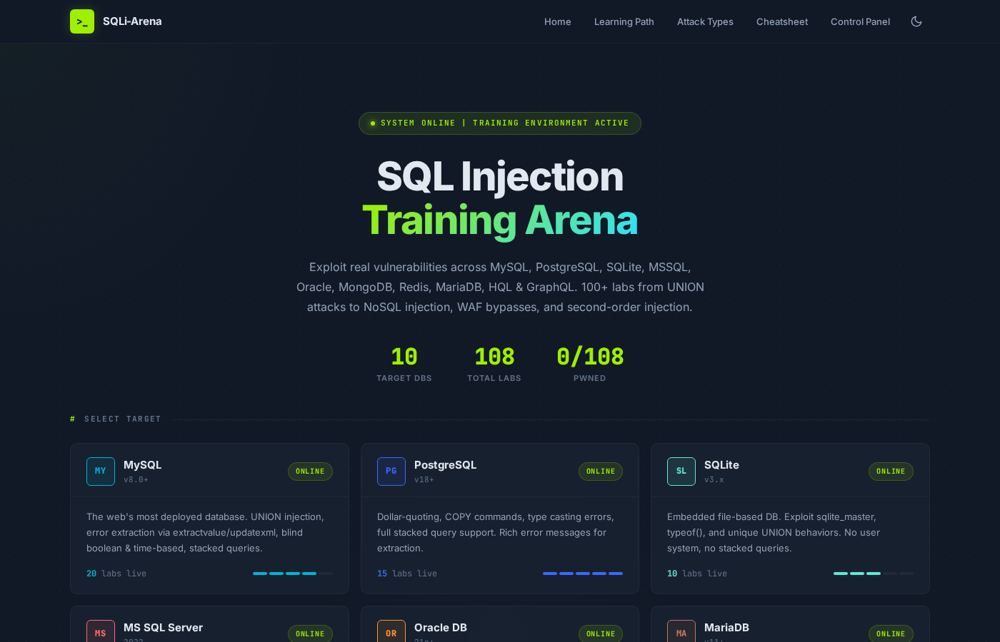
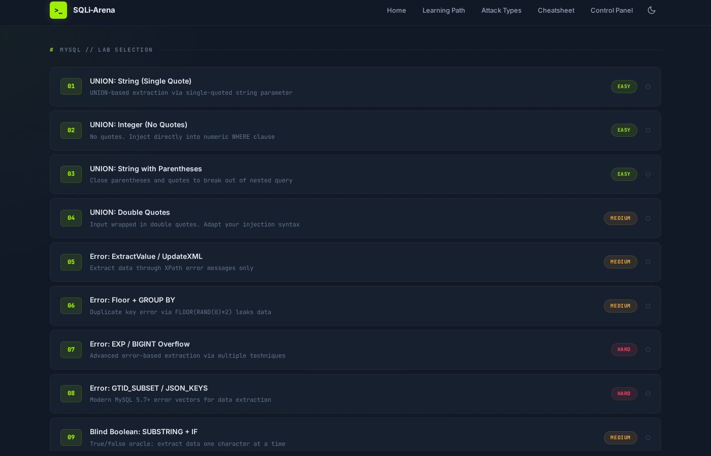
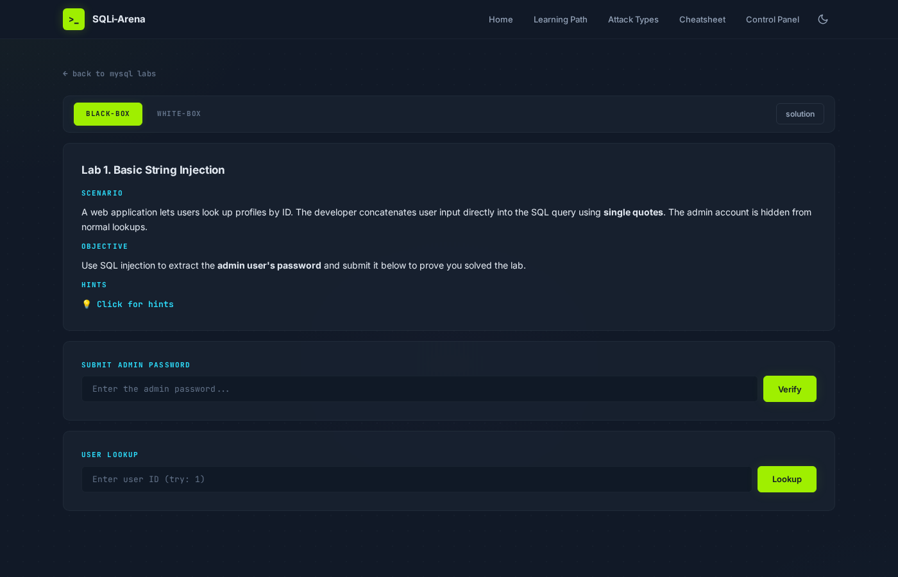
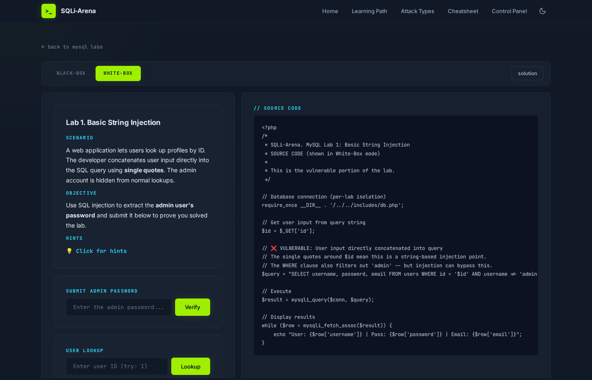
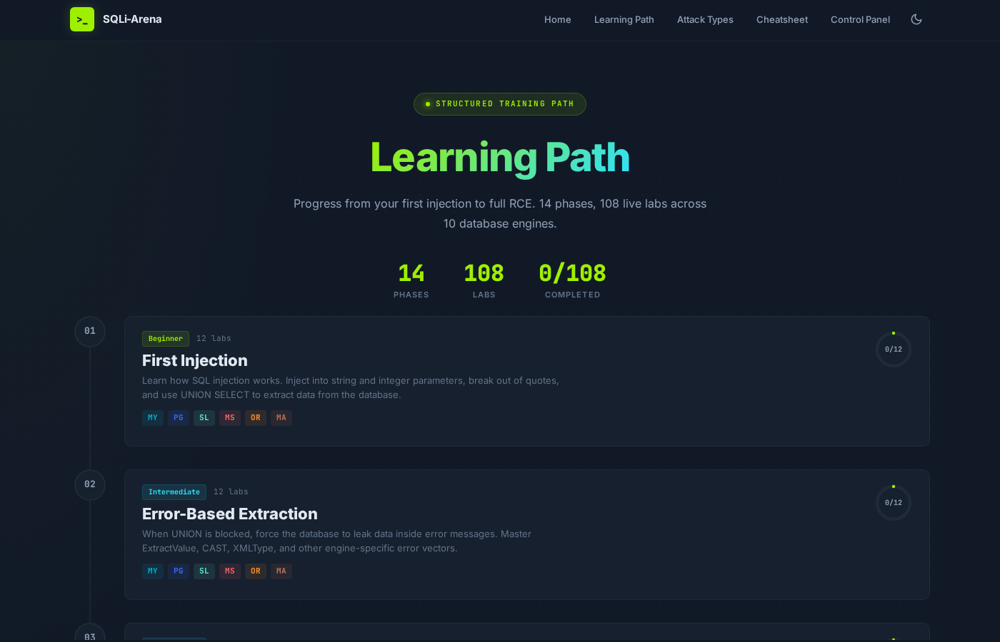
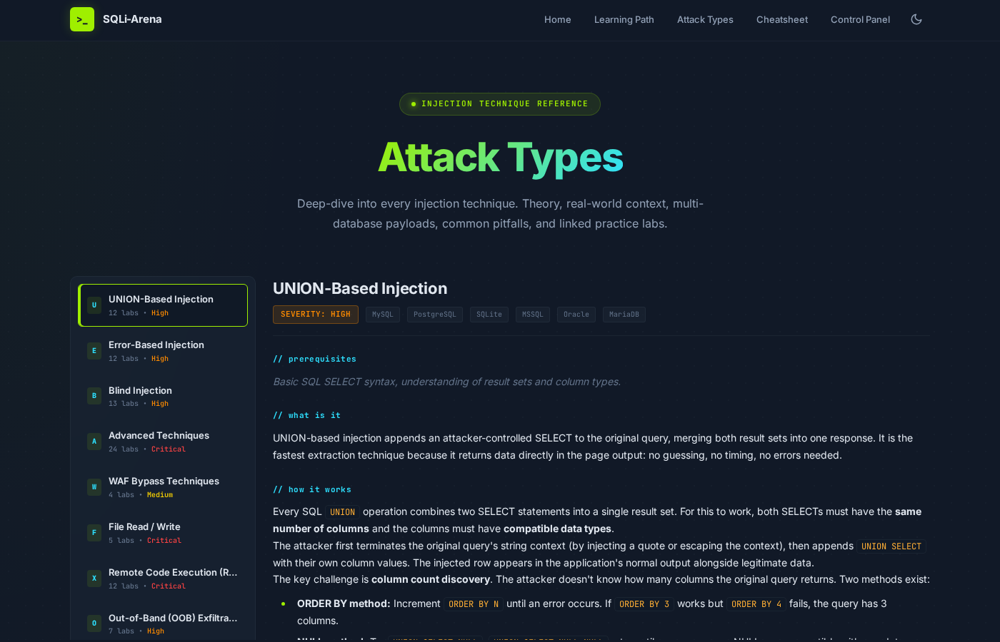
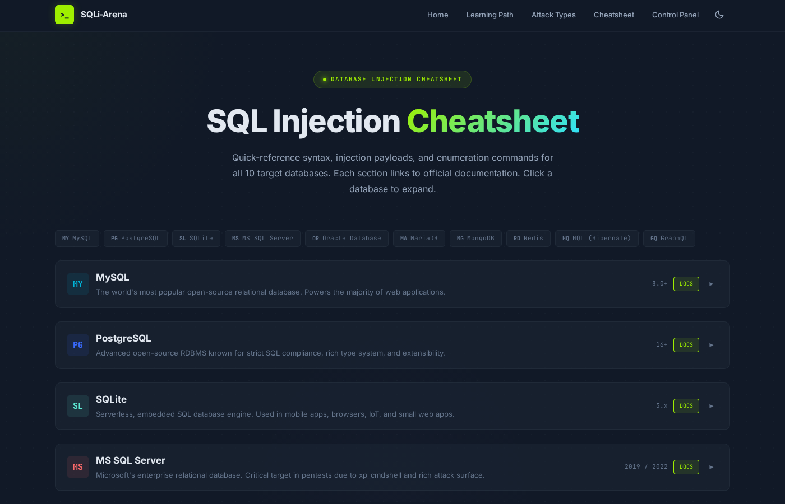
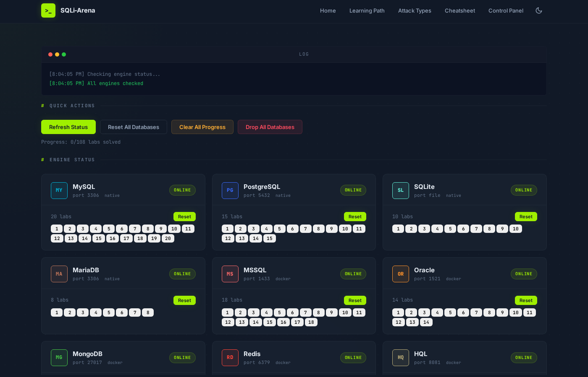

<p align="center">
  
</p>

# SQLi-Arena

A self-hosted SQL injection training platform with **108 labs** across **10 database engines**. Practice everything from basic UNION injection to blind extraction, WAF bypasses, NoSQL operator injection, and second-order attacks.

Built for pentesters, bug bounty hunters, and security students who want hands-on practice against real databases — not simulations.

## Supported Databases

| Engine | Labs | Type | Port |
|--------|------|------|------|
| MySQL 8.0+ | 20 | Native | 3306 |
| PostgreSQL 18+ | 15 | Native | 5432 |
| SQLite 3.x | 10 | Native | file |
| MariaDB 11+ | 8 | Native | 3306 |
| MS SQL Server 2022 | 18 | Docker | 1433 |
| Oracle 21c | 14 | Docker | 1521 |
| MongoDB 7+ | 8 | Docker | 27017 |
| Redis 7+ | 5 | Docker | 6379 |
| HQL (Hibernate 6+) | 5 | Docker | 8081 |
| GraphQL | 5 | Docker | 4000 |

## Screenshots

<p align="center">
  
  
</p>
<p align="center">
  
  
</p>
<p align="center">
  
  
</p>
<p align="center">
  
  
</p>

## Features

- **108 labs** across 10 database engines with real vulnerable queries
- **Black-box and white-box modes** for each lab
- **Solution walkthroughs** with step-by-step exploitation guides
- **14-phase learning path** — structured progression from first injection to RCE
- **Attack types reference** with theory, payloads, and linked labs
- **Built-in cheatsheet** with payloads for all engines
- **Progress tracking** with per-lab solved state
- **Individual lab reset** to restore databases to default
- **Dark and light themes**
- **Burp Suite integration** via `sqli-arena.local` hostname
- **Control panel** with engine status, one-click setup/reset, and log terminal
- **Clean URLs** (`/mysql/lab1`, `/learning-path/first-injection`, `/attack-types/union`)
- **Docker Compose** for containerized engines (MSSQL, Oracle, MongoDB, Redis, HQL, GraphQL)

## Quick Start

```bash
git clone https://github.com/Alien0ne/SQLi-Arena.git
cd SQLi-Arena
sudo bash install.sh
```

The installer handles everything: packages, PHP extensions, services, Apache config, Docker containers, database initialization, web deployment, and hostname setup.

Once complete:

```
http://localhost/SQLi-Arena/
http://sqli-arena.local/SQLi-Arena/   # For Burp Suite proxy capture
```

## Requirements

- **OS:** Linux (Kali, Debian, Ubuntu)
- **RAM:** 4 GB min / 8 GB recommended
- **Software:** Apache 2.4+, PHP 8.1+, MySQL 8.0+, PostgreSQL 14+, SQLite 3, Docker + Compose

## Management

```bash
sudo bash setup.sh                # Re-initialize all databases
bash setup/docker_start.sh        # Start Docker containers
bash setup/docker_stop.sh         # Stop Docker containers
sudo bash setup/cleanup.sh        # Full cleanup (removes everything)
```

Or use the **Control Panel** in the web UI.

## Burp Suite Integration

The installer adds `sqli-arena.local` to `/etc/hosts`. Browsers bypass proxy for `localhost`, so use this hostname to capture all traffic in Burp:

1. Burp proxy on `127.0.0.1:8080`
2. Browser proxy to `127.0.0.1:8080`
3. Browse to `http://sqli-arena.local/SQLi-Arena/`

## Project Structure

```
SQLi-Arena/
├── public/              # Web root
│   ├── index.php        # Homepage
│   ├── lab.php          # Lab runner (black/white/solution)
│   ├── labs.php         # Lab listing per engine
│   ├── learning-path.php
│   ├── attack-types.php
│   ├── cheatsheet.php
│   ├── control-panel.php
│   └── assets/          # CSS, JS
├── labs/                # 10 engine subdirectories
├── includes/            # Config, header, footer, helpers
├── setup/               # DB init scripts, Docker scripts, cleanup
├── docker/              # Dockerfiles for HQL & GraphQL
├── docker-compose.yml
├── install.sh           # End-to-end installer
└── setup.sh             # Database re-initialization
```

## Contributing

1. Fork the repo
2. Create a branch (`git checkout -b feature/new-lab`)
3. Add lab files in `labs/{engine}/` and DB init in `setup/`
4. Test both black-box and white-box modes
5. Submit a PR

## 🛡️ Disclaimer

This repository is for **educational and authorized testing purposes only**.
Use only in labs or environments you are explicitly permitted to assess.

---

## ‼️ Legal Disclaimer

THIS SOFTWARE IS PROVIDED "AS IS", WITHOUT WARRANTY OF ANY KIND, EXPRESS OR IMPLIED.
IN NO EVENT SHALL THE AUTHORS OR CONTRIBUTORS BE LIABLE FOR ANY CLAIM, DAMAGES OR OTHER LIABILITY ARISING FROM THE USE OF THIS REPOSITORY.

---

## ✍️ Author

- 🔗 [LinkedIn](https://www.linkedin.com/in/narasimhatiruveedula/)
- 💻 [TryHackMe (AlienOne)](https://tryhackme.com/p/AlienOne)
- 🐙 [GitHub (Alien0ne)](https://github.com/Alien0ne)
- 🌐 [Website](https://www.alienone.in/)

---

## License

MIT License — see [LICENSE](LICENSE).
